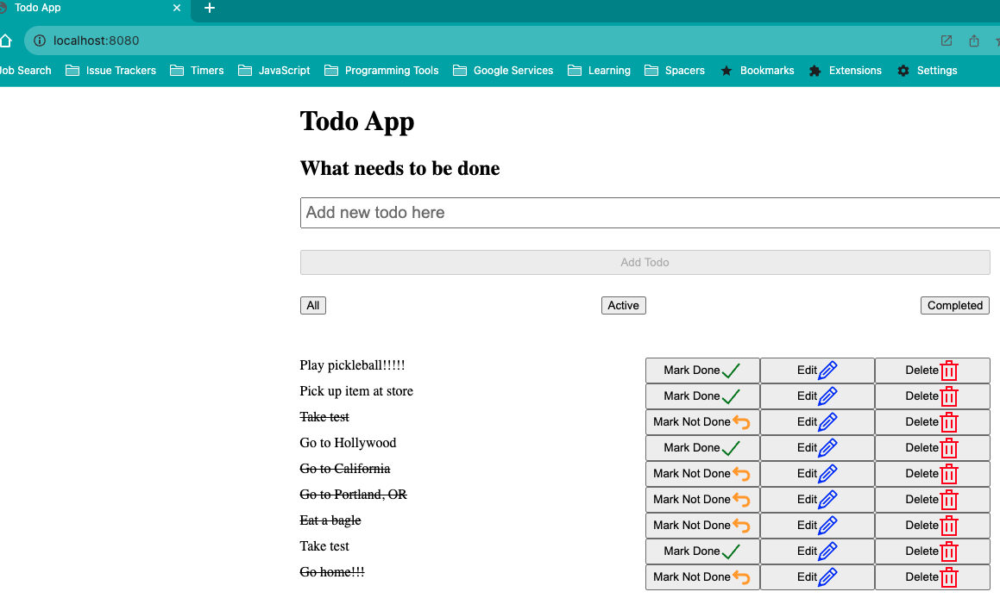
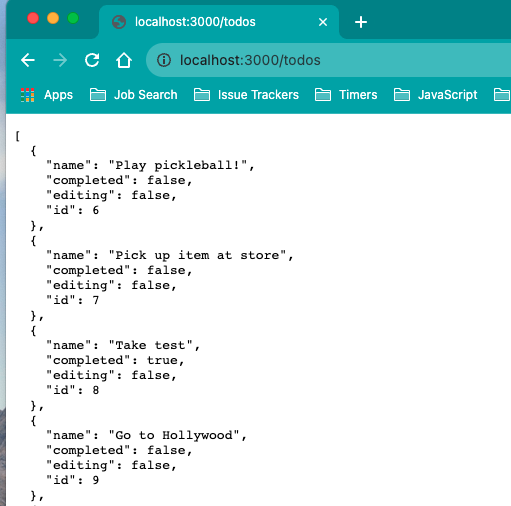
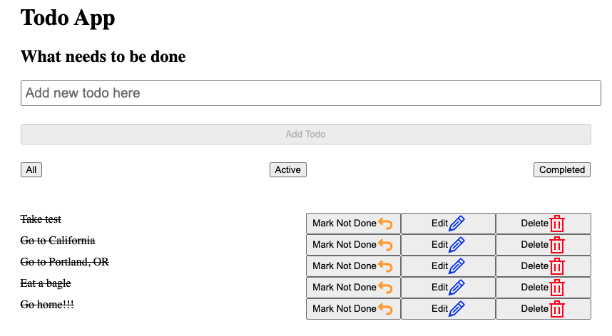

# React Todo App using Vite

This app that uses [Vite](https://vitejs.dev/) and functional React components shows a simple todo list and the json-server npm package to create a fake REST API that has full CRUD operations:

## How to Use

- In the root of this repo run in your terminal run:  
  `npm  i`

### Start App

- Then in the same directory do:
  `npm start`
- Open up another terminal window or tab and to start the server that runs the JSON endpoint and shows `npm run server` and you should be able to view [http://localhost:3000/todos](http://localhost:3000/todos) on your browser that shows a JSON endpoint of todos like below:
  
- If you open the Localhost URL that uses the default Vite port and shows the React Todo App (like [http://localhost:5173/](http://localhost:5173/)) you should see something like the screenshot below:
  
- If you complete any of the actions below on [http://localhost:5173/](http://localhost:5173/) then the **db.json** file will also get updated:
  - Add new todo item (enter text in `input#new-todo` element and then click "Add Todo" button)
  - Click on the "Mark Done", "Edit", or "Delete" buttons
- If you click on the "All", "Active", or "Completed" buttons the list of todo items will change on the frontend but the **db.json** file will not get updated (screenshot below when "Completed" button was clicked):
  

## Build and Open Built App

- In another terminal tab do:
  `npm run build`
- Then to open the built **dist/index.html** file that uses the built JavaScript in the terminal do:
  `npm run buildopen`
